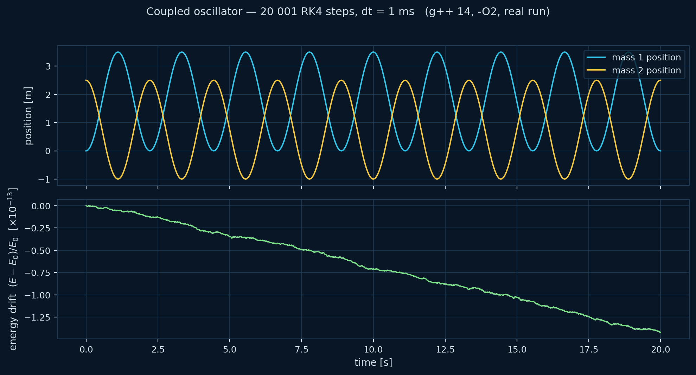

# Separation of Concerns at Zero Cost — Modular Physics in C++20

Companion repository for the ACCU on Sea 2026 talk **"Separation of Concerns at
Zero Cost — Modular Physics in C++20"** by Jędrzej Michalczyk (SpaceForest).

> *Conference talk:* Saturday 20 June 2026, Leas Cliff Hall, Folkestone, Kent, UK.

This repo carries the slide deck plus the **minimal, self-contained code** for the
example that anchors the talk: a **coupled oscillator** — two point masses joined by
a spring — assembled from independent, single-responsibility components and solved
with a generic RK4 integrator, with **zero runtime cost** for the abstraction.

The code here is a focused extract of the larger
[`sopot`](https://github.com/jedrzejmichalczyk/sopot) project, pared down to exactly
what the two-point-mass example needs.

## The idea in one example

Each physical concept is its own component — a `PointMass`, a `Spring`, an
`EnergyMonitor` — each declaring what it *provides* and what it *requires* as
compile-time tags. The system wires them together by overload resolution over the
component tuple, the completeness of the wiring is checked by concepts at compile
time, and the whole thing collapses to the same machine code you'd write by hand.

```cpp
auto sys = createCoupledOscillator<double>(
    1.0, 0.0, 0.0,   // m1, x1_0, v1_0
    1.0, 2.5, 0.0,   // m2, x2_0, v2_0  (spring stretched 1.5 m past L0)
    4.0, 1.0);       // k, L0

static_assert(decltype(sys)::hasFunction<system::TotalEnergy>());
```

## Layout

```
core/                          Generic, domain-agnostic machinery
  scalar.hpp                   Scalar concept (lets the same code run double or a dual number)
  dual.hpp                     Forward-mode autodiff dual numbers
  units.hpp                    Compile-time units
  state_function_tags.hpp      Tag infrastructure for state functions
  typed_component.hpp          The component model + provider discovery + completeness check
  solver.hpp                   Generic RK4 ODE solver
physics/coupled_oscillator/    The two-point-mass domain
  tags.hpp                     Quantity tags (Position, Velocity, Force, ...)
  point_mass.hpp               Point-mass component
  spring.hpp                   Spring component
  energy_monitor.hpp           Total-energy observer
  coupled_system.hpp           Assembles the components into a system
examples/
  oscillator_demo.cpp          Runs the system, dumps energy data, reports drift
  energy_conservation.png      Reference plot (regenerated by scripts/make_plot.py)
scripts/
  make_plot.py                 Renders the energy-conservation plot in the deck's theme
slides/
  ACCU-Separation-of-Concerns-at-Zero-Cost.pptx
  ACCU-Separation-of-Concerns-at-Zero-Cost.pdf
```

## Build & run

Requires a C++20 compiler (tested with g++ 14.1.0). Header-only — no dependencies.

### CMake

```sh
cmake -B build
cmake --build build
cd build && ./oscillator_demo          # writes oscillator_data.csv
python ../scripts/make_plot.py         # writes energy_conservation.png
```

### One-liner (g++)

```sh
g++ -std=c++20 -O2 -I. examples/oscillator_demo.cpp -o oscillator_demo
./oscillator_demo
```

Expected output (20 001 RK4 steps, dt = 1 ms):

```
steps=20001  wall=~17 ms  E0=24.500000000000000  max_rel_drift=1.424e-13
```

Energy is conserved to ~1e-13 relative drift over the full run — the abstraction
adds nothing the optimizer can't see through.



## License

See [LICENSE](LICENSE). Code extracted from the `sopot` project.
